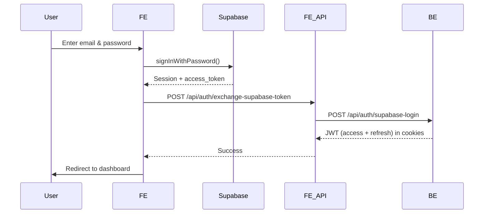
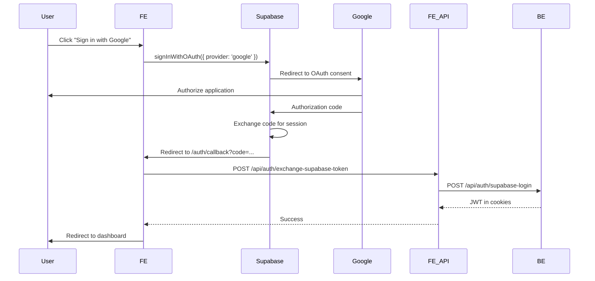
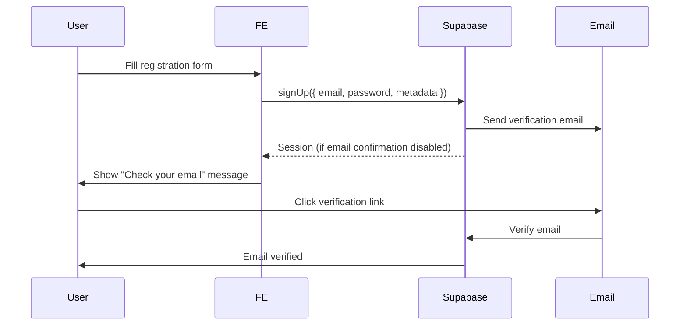

# Supabase Auth Implementation

This document describes the Supabase authentication integration for the TrustFundMe frontend application.

## Overview

The application uses Supabase for frontend authentication (email/password + Google OAuth) and exchanges Supabase access tokens for JWT tokens from the TrustFundMe backend.

## Architecture

```
┌─────────┐         ┌──────────┐         ┌─────────────┐         ┌──────────┐
│ Browser │ ──────> │ Supabase │ ──────> │ FE API      │ ──────> │ BE API   │
│         │         │   Auth   │         │ (Next.js)   │         │ Gateway  │
└─────────┘         └──────────┘         └─────────────┘         └──────────┘
     │                    │                       │                      │
     │                    │                       │                      │
     └────────────────────┴───────────────────────┴──────────────────────┘
                    Session Management & Token Exchange
```

## Environment Variables

Create a `.env.local` file in the project root with the following variables:

```env
NEXT_PUBLIC_SUPABASE_URL=your_supabase_project_url
NEXT_PUBLIC_SUPABASE_ANON_KEY=your_supabase_anon_key
BE_API_GATEWAY_URL=http://localhost:8080
```

### Getting Supabase Credentials

1. Go to [Supabase Dashboard](https://app.supabase.com)
2. Create a new project or select an existing one
3. Go to Settings > API
4. Copy the "Project URL" → `NEXT_PUBLIC_SUPABASE_URL`
5. Copy the "anon public" key → `NEXT_PUBLIC_SUPABASE_ANON_KEY`

## Authentication Flow

### 1. Email/Password Authentication



### 2. Google OAuth Authentication



### 3. User Registration



## Key Components

### AuthContext (`src/contexts/AuthContext.tsx`)

Provides authentication state and methods throughout the application:

- `user`: Current user object with metadata
- `session`: Supabase session
- `isAuthenticated`: Boolean indicating if user is logged in
- `isEmailVerified`: Boolean indicating if email is verified
- `login(email, password)`: Sign in with email/password
- `signUp(email, password, firstName, lastName)`: Register new user
- `logout()`: Sign out from both Supabase and BE
- `signInWithGoogle()`: Initiate Google OAuth flow
- `resendVerificationEmail(email)`: Resend email verification
- `updateUser(updates)`: Update local user state

### ProtectedRoute (`src/components/ProtectedRoute.tsx`)

Wrapper component that protects routes requiring authentication:

```tsx
<ProtectedRoute requireEmailVerified={true}>
  <YourProtectedPage />
</ProtectedRoute>
```

### EmailVerificationBanner (`src/components/EmailVerificationBanner.tsx`)

Displays a banner when user's email is not verified, with option to resend verification email.

### UserDropdown (`src/components/UserDropdown.tsx`)

User menu dropdown in the header showing:
- User avatar (from Supabase Storage) or initials
- User name and email
- Links to Profile and Dashboard
- Sign out button

## API Routes

### `/api/auth/exchange-supabase-token` (POST)

Exchanges Supabase access token for BE JWT tokens.

**Request:**
```json
{
  "accessToken": "supabase_access_token"
}
```

**Response:**
```json
{
  "success": true,
  "user": { ... }
}
```

**Backend Contract:**
- Endpoint: `POST /api/auth/supabase-login`
- Payload: `{ "provider": "supabase", "accessToken": "..." }`
- Response: Sets httpOnly cookies with `access_token` and `refresh_token`

### `/api/auth/logout` (POST)

Logs out from BE and clears JWT cookies.

### `/api/users/profile` (PUT)

Syncs user profile data with BE.

**Request:**
```json
{
  "firstName": "John",
  "lastName": "Doe",
  "phone": "+84 123 456 789",
  "birthday": "1990-01-01"
}
```

### `/api/users/profile/avatar` (POST)

Syncs avatar URL with BE.

**Request:**
```json
{
  "avatarUrl": "https://supabase.co/storage/v1/object/public/avatars/..."
}
```

## Supabase Storage Setup

### Create Storage Bucket

1. Go to Supabase Dashboard > Storage
2. Create a new bucket named `avatars`
3. Set bucket to **Public**
4. Configure RLS policies:

```sql
-- Allow authenticated users to upload their own avatars
CREATE POLICY "Users can upload own avatar"
ON storage.objects FOR INSERT
TO authenticated
WITH CHECK (bucket_id = 'avatars' AND (storage.foldername(name))[1] = auth.uid()::text);

-- Allow public read access
CREATE POLICY "Public avatar access"
ON storage.objects FOR SELECT
TO public
USING (bucket_id = 'avatars');
```

## User Profile Management

### Profile Page (`/account/profile`)

Users can:
- View and edit first name, last name, phone, birthday
- Upload profile avatar (stored in Supabase Storage)
- Changes are synced to both Supabase metadata and BE database

### Avatar Upload Flow

1. User selects image file
2. File is validated (type, size)
3. File is uploaded to Supabase Storage (`avatars/{userId}/{timestamp}.ext`)
4. Public URL is obtained
5. URL is saved to user metadata in Supabase
6. URL is synced to BE via API

## Email Verification

### Verification Status

- Checked via `user.email_confirmed_at` from Supabase
- Exposed as `isEmailVerified` in AuthContext
- Banner shown on dashboard if email not verified

### Resending Verification Email

Users can resend verification emails from:
- Email verification banner
- Profile page (future enhancement)

## Route Protection

Protected routes use the `ProtectedRoute` component:

```tsx
// Require authentication only
<ProtectedRoute>
  <Dashboard />
</ProtectedRoute>

// Require authentication + email verification
<ProtectedRoute requireEmailVerified={true}>
  <AccountPage />
</ProtectedRoute>
```

## Session Management

### Supabase Session
- Managed automatically by Supabase client
- Stored in browser (localStorage/sessionStorage)
- Auto-refreshed when expired

### BE JWT Session
- Stored in httpOnly cookies
- Access token: 15-30 minutes
- Refresh token: 7-30 days
- Exchanged on login/OAuth callback

## Security Considerations

1. **Token Exchange**: Supabase tokens are exchanged server-side to prevent exposure
2. **Cookie Security**: BE JWT cookies use httpOnly, secure, sameSite=strict
3. **Storage Access**: Avatar bucket uses RLS policies to restrict access
4. **Email Verification**: Required for full account access
5. **Password Requirements**: Enforced on both client and server (Supabase)

## Testing

### Test Scenarios

1. **Email/Password Login**
   - Register new user → Verify email → Login → Access dashboard

2. **Google OAuth**
   - Click "Sign in with Google" → Authorize → Redirect to dashboard

3. **Email Verification**
   - Register → See banner → Resend email → Verify → Banner disappears

4. **Profile Management**
   - Update name/phone/birthday → Changes reflected in UI
   - Upload avatar → Avatar appears in header dropdown

5. **Logout**
   - Click sign out → Redirected to sign-in → Cannot access protected routes

## Troubleshooting

### "Supabase environment variables are not set"
- Ensure `.env.local` exists with correct values
- Restart Next.js dev server after adding env vars

### "Failed to exchange token"
- Check BE API Gateway is running
- Verify `BE_API_GATEWAY_URL` is correct
- Check BE endpoint `/api/auth/supabase-login` exists

### Avatar upload fails
- Verify `avatars` bucket exists in Supabase Storage
- Check RLS policies are configured correctly
- Ensure bucket is set to Public

### Email verification not working
- Check Supabase email settings
- Verify SMTP is configured (if using custom SMTP)
- Check spam folder for verification emails

## Next Steps

1. **Backend Implementation**: Implement `/api/auth/supabase-login` endpoint in BE
2. **Profile Sync**: Implement BE endpoints for profile updates
3. **Error Handling**: Add comprehensive error handling and user feedback
4. **Testing**: Add E2E tests for auth flows
5. **Analytics**: Track auth events for monitoring

## References

- [Supabase Auth Documentation](https://supabase.com/docs/guides/auth)
- [Supabase Storage Documentation](https://supabase.com/docs/guides/storage)
- [Next.js API Routes](https://nextjs.org/docs/app/building-your-application/routing/route-handlers)
